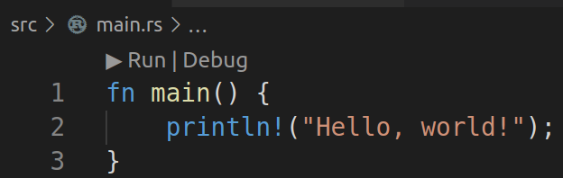
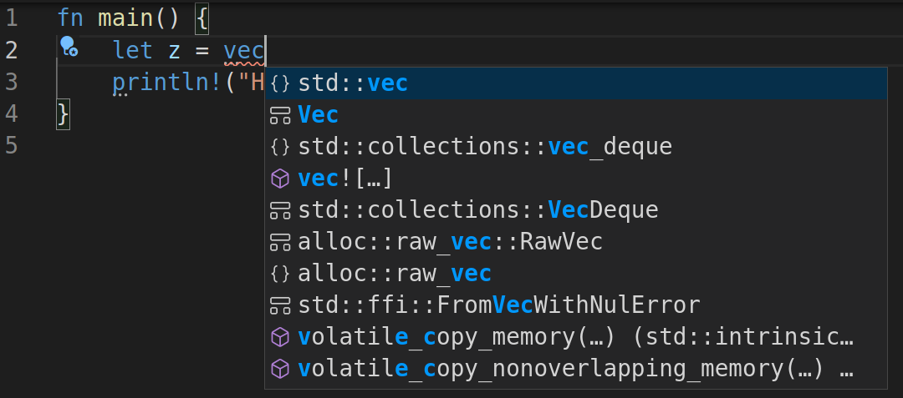

# VSCode-Rust template

How to set up VS code to work with rust, including debugging.

1) Install `rust-analyzer` extension. 

      code --install-extension matklad.rust-analyzer

  It provides a nice UI for running binaries and tests:

  

  Also it gives a lot of hints:

  

  Note that `rust-analyzer` doesn't work together with `Rust` extension (Rust for Visual Studio Code). You would have to uninstall or debug the later.

2) 